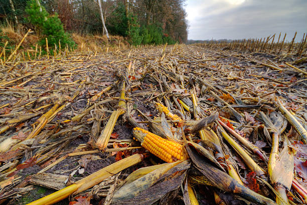

## Project Overview: Tackling Post-Harvest Losses in Nigeria

{width="696"}

According to the Federal Ministry of Agriculture and Rural Development (FMARD), Nigeria loses between **30% to 50%** of its perishable agricultural produce annually due to poor storage, transportation, and processing infrastructure. The **World Bank** estimates that these losses cost Nigeria approximately **\$9 billion** every year — food that could otherwise feed millions and create profitable agribusiness opportunities.

### Key Statistics

-   **40%** of Nigeria’s total agricultural production is lost or wasted annually.

-   These losses:

    -   Consume **31% of total land** used for production.
    -   Contribute **5% of Nigeria’s greenhouse gas emissions**.
    -   Represent a staggering **9.1% of Nigeria’s GDP**.

-   Meanwhile, **44% of Nigerians are food insecure**, with the population projected to increase by **over 50% by 2050**.

### Data Sources

-   FAOSTAT 2017

-   The Herald

-   Africa Check 36

-   World Bank Open Data

-   UN Population Prospects

-   WRI CAIT Climate Data Explorer

-   FAO et al. (2019)

-   WB Calculations

-   FAO Food Loss and Waste Database: <https://www.fao.org/platform-food-loss-waste/flw-data/en>

-   Harvest Data:

    -   <https://mapspam.info/data/>
    -   <https://dataverse.harvard.edu/dataverse/harvestchoice>

### Insights from Loss Percentage and Price Data

An analysis of post-harvest loss percentages across Nigerian regions reveals:

-   **Kaduna (3.77%)** and **Katsina (3.75%)** experience the highest post-harvest losses, indicating systemic inefficiencies in handling and storage, likely due to infrastructural and logistical challenges.
-   **Ebonyi (3.23%)** and **Niger (3.23%)** follow closely with elevated loss rates.
-   Despite significant losses, Kaduna (₦10,261 Million) and Katsina (₦9,113 Million) show moderate average market prices, suggesting that factors beyond losses—such as market access, demand, and supply chains—heavily influence pricing dynamics.
-   **Benue State**, with a lower loss percentage (2.45%), does not feature in the top price brackets, reinforcing this complexity.
-   A notable outlier is **Sokoto**, with an exceptionally low average price of ₦146 Million, potentially due to oversupply, limited market access, or data anomalies.
-   Conversely, **Abia State** commands the highest average price, highlighting regional disparities in market dynamics.

### Explore More

All project insights, visualizations, and interactive dashboards are available on the project website: 👉 [**AgricConnect-PHL**](https://user.quarto.pub/agrifinanceconnect/)
